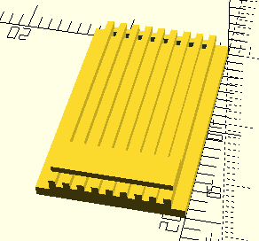
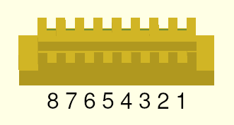
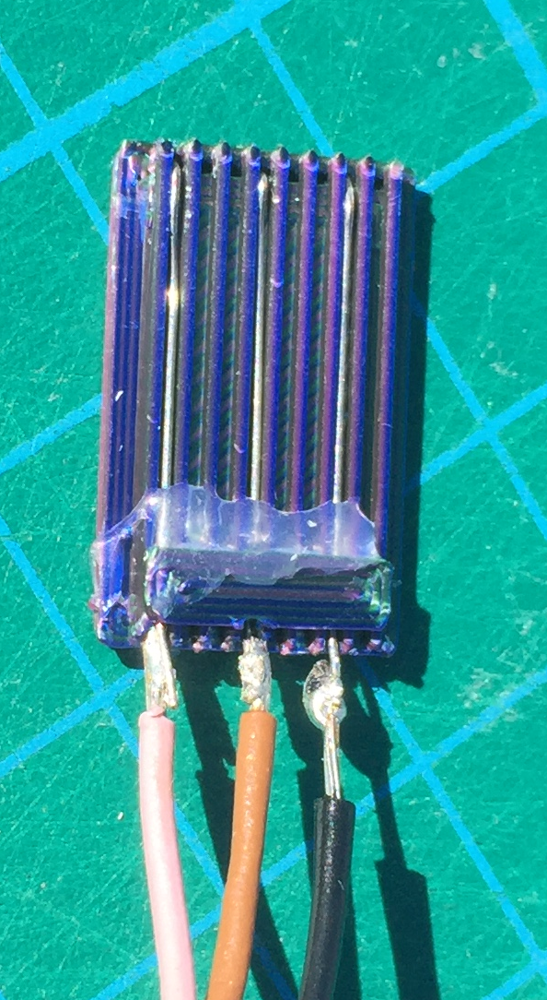
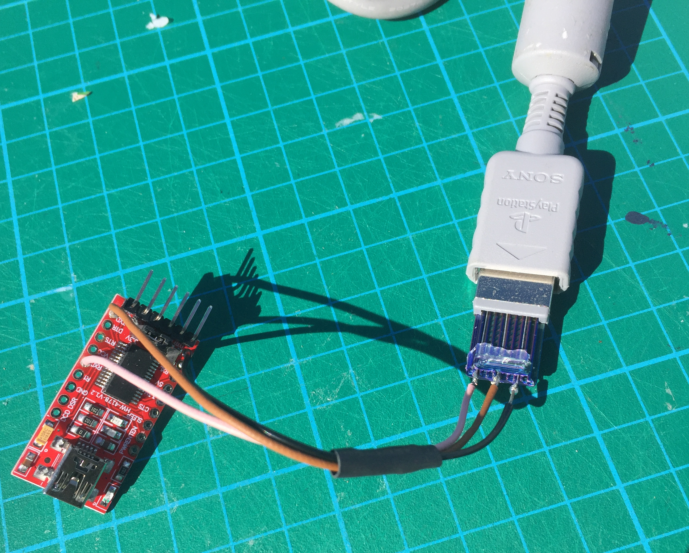

[![CC BY-SA 4.0][cc-by-sa-shield]][cc-by-sa]

This work (3D model) is licensed under a
[Creative Commons Attribution-ShareAlike 3.0 International License][cc-by-sa].

This is a 3d printable connector that fits into the end of an official PSX serial / link cable to enable DIY serial connections.

Available on Thingiverse as [thing:6737062](https://www.thingiverse.com/thing:6737062)

I didn't want to cut up / ruin an existing link cable, or solder extra connectors to my PSX.

I used trimmed resistor leads for the contacts. Bend the ends just under 1mm from the end to hook into the holes at the end which fits into the cable.
Not sure how critical this is, but I made sure there was a slight upward curve in the wires at this end to ensure they made contact.

The other ends fit under the "bridge" and can be soldered to. Attach the wires just before the bridge with a thin run of hot-melt glue.

Test connectivity with a multimeter. The PSX link cable swaps TX and RX (pins 5 and 8), so you'll need to check pin 5 of this connector to pin 8 of the other end etc.

Connect to a FTDI FT232RL serial-to-USB adapter board (3.3V) or similar. I only used 3 wires (RX, TX, and GND), but this should work with more wires if you need them.

## Print settings
Mine is printed on a Snapmaker 2.0 A350 using the "Precise & Strong" preset.
 It printed first time. It was meant to be a resolution test for the holes and ridges, but it worked well enough to get me connected.

* Material: PLA, tri-chromatic, (what I had on the machine at the time)
* Layer height: 0.16mm
* Line width: 0.4mm
* Speed: 50mm/s
* Wall thickness: 1.2mm
* Infill Density: 25% (although at this scale I think it's effectively 100%. Everything is a wall. You'll want it as strong as possible anyway.)

No guarantees that your printer will be able to print this fine. I was surprised it worked, but it appears to be working well.
The walls between the 8 wire channels are only one filament width thick, and the edging around the holes is only two filament widths thick.
I barely had to clean out the holes, they were well formed, but I poked through a piece of wire just to be sure they were completely clean.

The cable can be handled and plugged / unplugged. The strip of hot melt glue seems necessary with the current design.
It's not yet an enclosed cable, and the FTDI board is just hanging loose between the PSX and my laptop, but the USB + link cable gives plenty of room to move around, and the whole setup doesn't feel fragile, although it might break if you dropped something on it...
Certainly I have not had any problems with lose connections or transmissions interrupted because of bad soldering or loose fit, so this is working perfectly for now.

Future designs might include a proper enclosed cable, and/or a version that plugs directly into the back of the PSX. Currently this _requires_ a PSX link cable.

## Pinout

Using the pinout from here: https://hitmen.c02.at/html/psx_siocable.html
, but looking at the connector from the back, from "inside the PSX":

* 8 RXD (receive; Rose wire)
* 7 +3.3V
* 6 DSR
* 5 TXD (transmit; Tan wire)
* 4 CTS
* 3 DTR
* 2 GND (ground; Black wire)
* 1 RTS

This photo shows everything linked, with the connector insterted into the PSX link cable. The FTDI board is conected to PC/laptop by standard USB cable (not shown).

**Note:** the PSX link cable handles the switching of transmit -> receive. Without the full pre-made cable, the wiring would need to be swapped.
* The RXD from connector pin 8 (rose wire) is soldered to the FTDI breakout's RXD.
* The TXD from connector pin 5 (tan wire) goes to the FTDI's TXD.
* Pin 2, Ground (black wire) goes to GND on the FTDI board.

[![CC BY-SA 3.0][cc-by-sa-image]][cc-by-sa]

[cc-by-sa]: http://creativecommons.org/licenses/by-sa/3.0/
[cc-by-sa-image]: https://licensebuttons.net/l/by-sa/3.0/88x31.png
[cc-by-sa-shield]: https://img.shields.io/badge/License-CC%20BY--SA%203.0-lightgrey.svg
